# Statikus kódanalízis
A statikus analízishez IntelliJ környezetben a SpotBugs eszközt használtuk.
A vizsgálat pillanatában 311 bug volt összesen 203 osztályban. A következőkben ezen hibák elemzése és bizonyos hibák javítása látható.

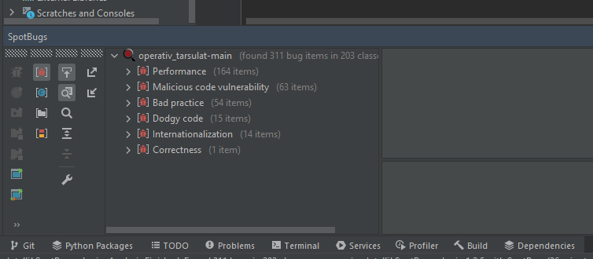

## Kijavított hibák:

- A metódus neve csak egy nagybetűvel kezdődéssel tért el az Object alaposztály metódusától, ami miatt egyszerűen össze lehet őket téveszteni. A metódus neve javítva lett egy beszédesebbre.

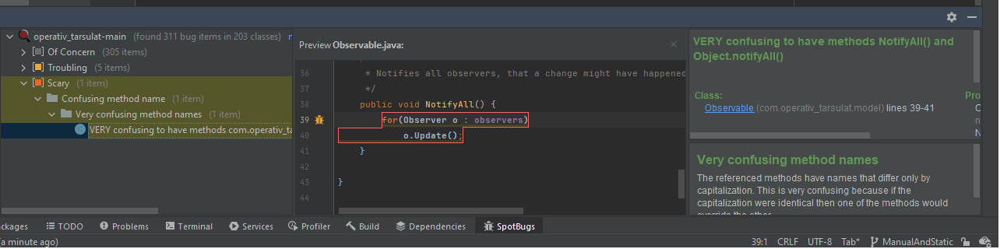
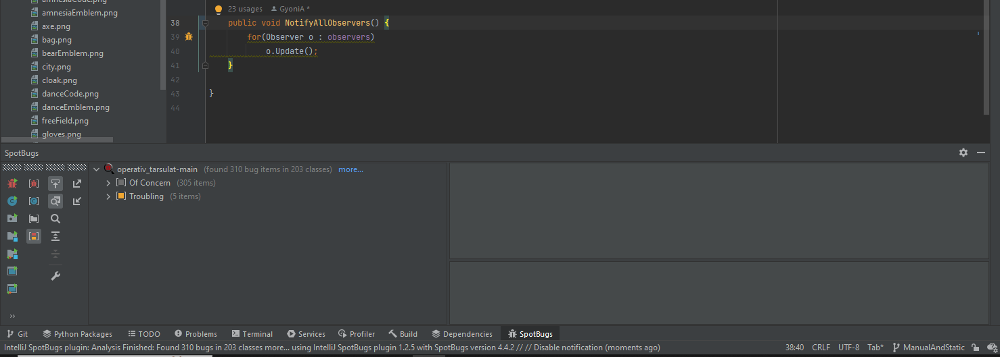

- A képen látható kódrészben egyenlőség operátorral hasonlítottunk össze stringeket, de ez nem jó sok esetben ezért lecseréltük a `String.equals()` metódusra.

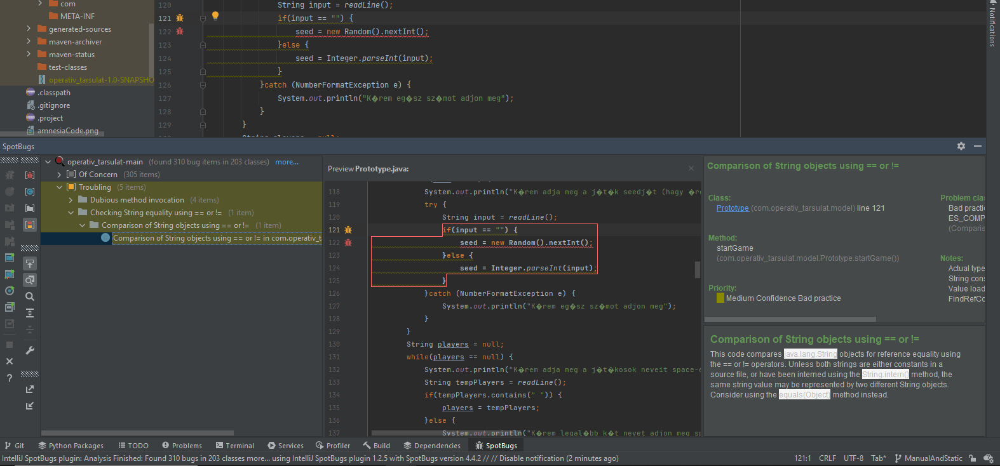
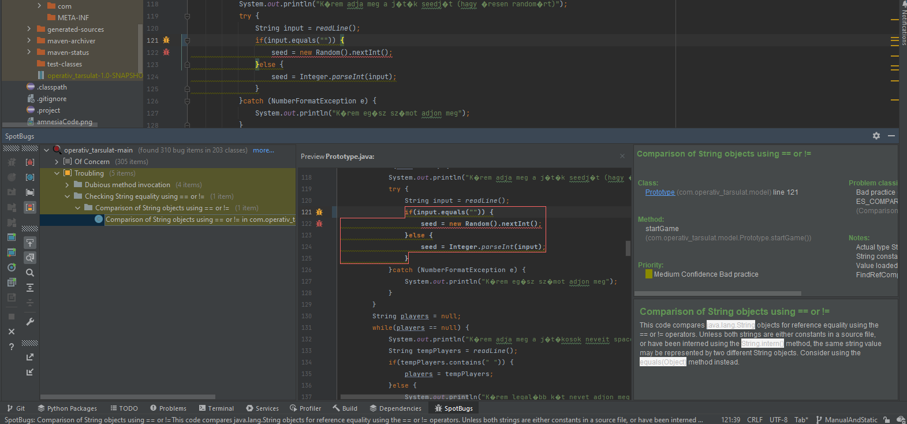

- Több helyen is csak 1 sorig létező random szám generátor objektumot hoztunk létre, ami nem hatékony, ezért külön osztálytól függő statikus változóba mentettük a random szám generátort.

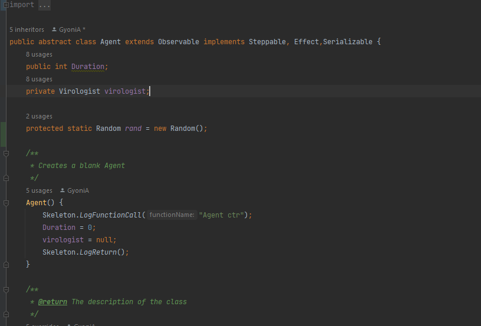
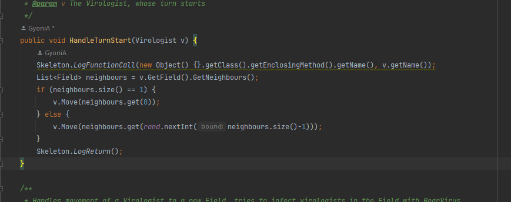

- Több helyen is null érték ellenőrzés nélkül használtunk szöveges bemenetet, ezekhez az esetekhez hozzáadtunk egy null érték ellenőrzést.

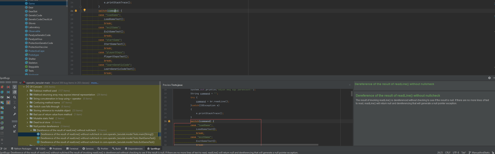
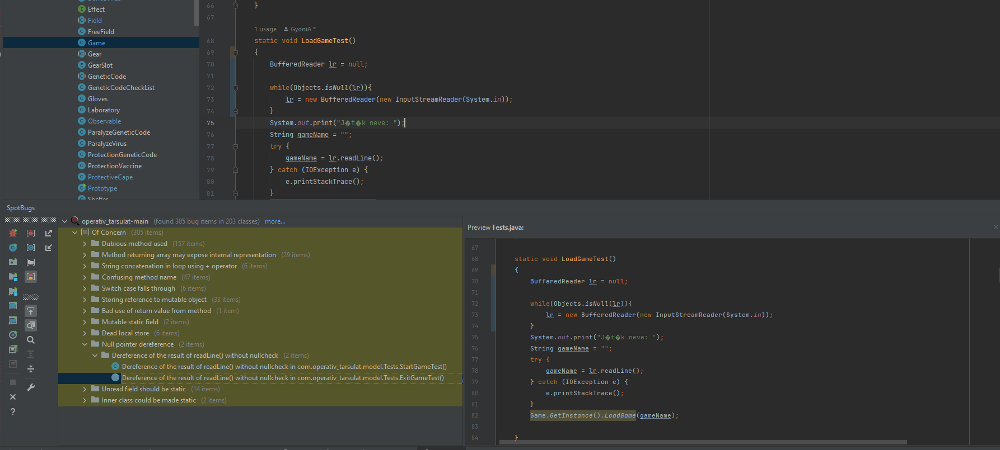

- Több helye is a switch case struktúrában nem volt default ág, ezért hozzáadtunk ezekhez default ágakat.

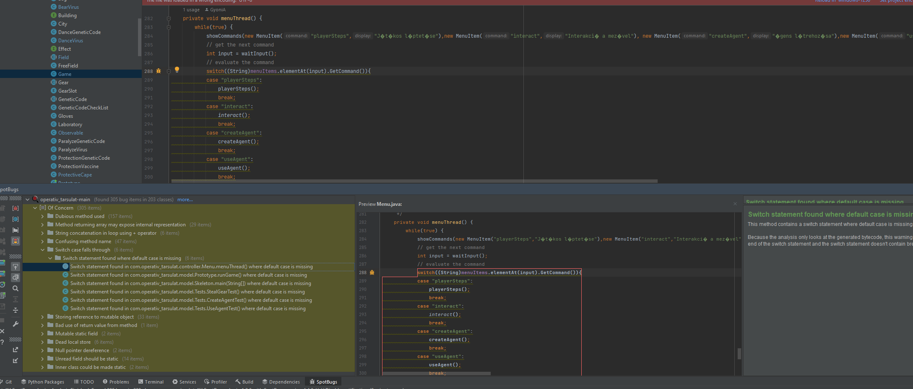
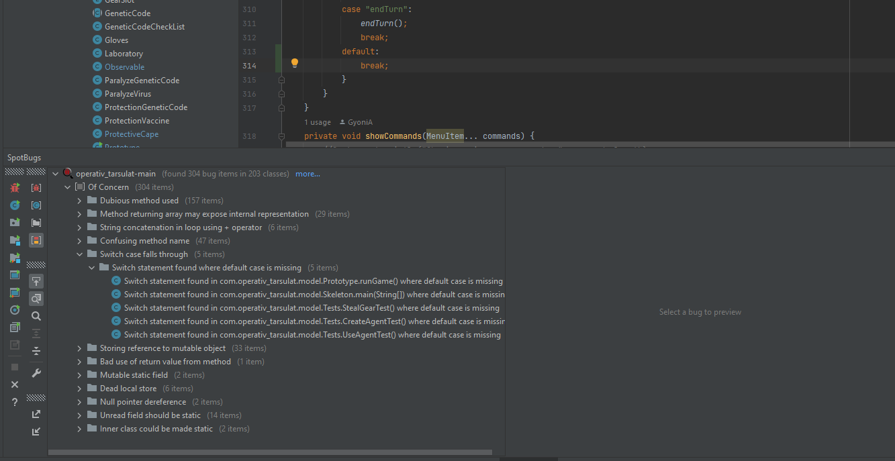

- Több helyen is az üres String konstruktorát használtuk, ezért ezeket a konstruktorokat lecseréltük az üres String literálra, mert az hatékonyabb.

- Több helyen is az egyenlőségjel operátort használtuk, ami nem jó, mert az `.equals()` metódusnak kellene lennie, mert ez hatékonyabb, ezért ezeket lecseréltük.

- Több helyen is + operátorral fűztünk össze stringeket, ezért ezeket az `.append()`-re cseréltük, mert az hatékonyabb.

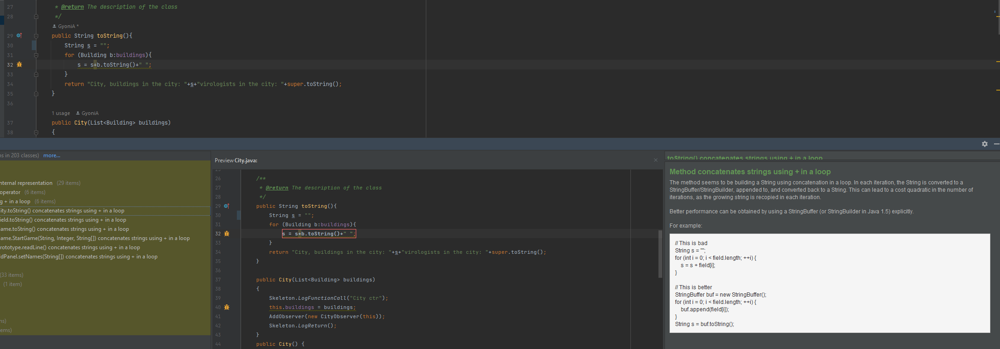
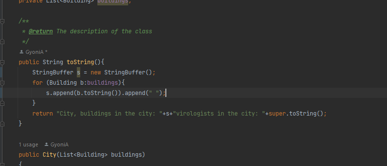

- Figyelmen kívül hagytuk azt az esetet, amikor a képen látható függvény kivétellel tér vissza. Egy try-catch blokk alkalmazásával megszűnt a hiba kezeletlenül maradásának a lehetősége.

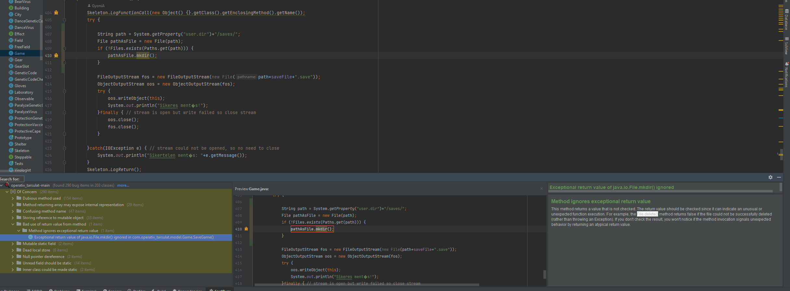
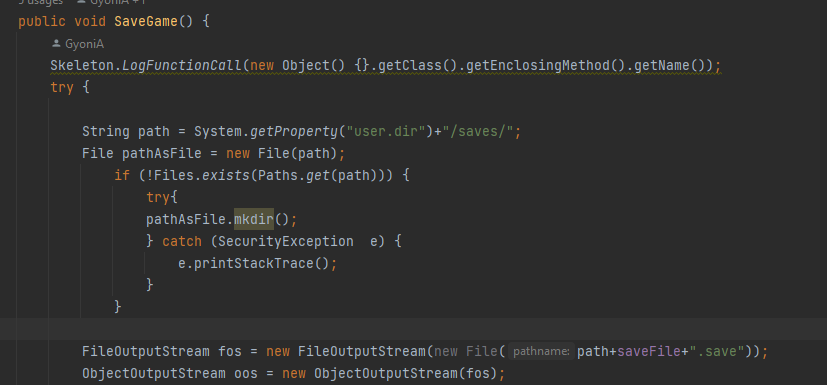

# Manuális kód átvizsgálás
Github-on használjuk a pull-request funkciót az új commitok hozzáadása után, amit átnéz egy másik csapattag és elfogadja, ha jó.

## Átvizsgáltuk a kódot és a következő hibákat találtuk:
- A játék megjelenítési felülete váltakozóan használja a magyar és az angol nyelvet, ezért a játékot át kellene alakítani, hogy csak egy nyelvet használjon, vagy ki kéne szervezni szövegeket egy nyelvi erőforrás fájlba.

- Találtunk beégetett konstansokat például a `Game.java` osztályban, amiket érdemes lenne kiszervezni változókba.

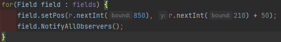

- Bent maradt a kódban több TODO is, ami nincs implementálva, de a megvalósítandó feladatokat nem írják le rendesen, így nehéz lenne utólag javítani a kódot, mert újra értelmezni kéne az egészet.

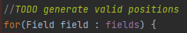

- A betöltésnél nem ellenőrizzük, hogy a fájlt sikeresen betöltöttük-e, ezért ha nem sikerül betölteni a fájlt, arról nem kapunk semmilyen visszajelzést és a program hibára futhat.

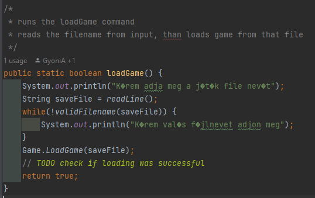

- Találtunk üres catch ágakat, amikbe érdemes lenne valamilyen hibakezelést írni. Itt lett hagyva auto generált TODO is.

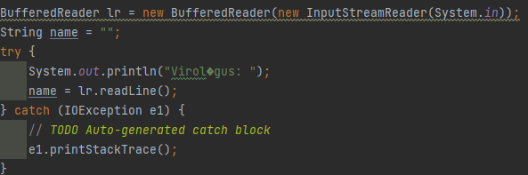