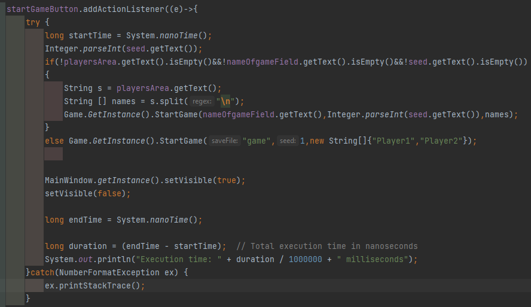

# Nem-funkcionális jellemzők vizsgálata

## Teljesítmény
A pálya legenerálása nagyjából 130-140 ms-t vesz igénybe, ami a játékmenet szempontjából nem jelentős és elég gyors, hogy a felhasználó ne érezze lassúnak.

A többi funkcióra is szinte egyből reagál a program, a pálya generálása a leglasabb folyamat a játékban és még itt se vesz észre jelentős késleltetést a felhasználó.

## Használhatóság
- Az alkalmazás előre beállított ablakmérettel jelenik meg, ami pixelben van megadva, ezt nem lehet módosítani, így különböző felbontású monitorokon előfordulhat, hogy nem komfortos az alkalmazás használata.
- A játék elkezdése előtt nincs használati útmutató a játékmenetről, így a felhasználók nem tudják megismerni a szabályokat. 
- A játék közben a felhasználók nem kapnak visszajelzéseket  tevékenységeikről/történésekről.
- Nehezen nyomonkövethető a játékmenet, a pálya nehezen látható, az ikonok alacsony felbontásúak és nem következik egyszerűen belőlük a mező típusa.
- A játék egyensúlya nem arányosan van kialakítva, leginkább a szerencsén múlik a játék végkimenetele.
- A főképernyőn nincs egyértelműen elkülöníve a betöltés és az új játék índítása funkció.
- Az elérhető interakciók felsorolása nehézkesen olvasható, a hierarchiában haladva könnyű "eltévedni"
- Hiányoznak a karaktermozgásról az animációk, amik könnyebben követhetővé tennék azt.