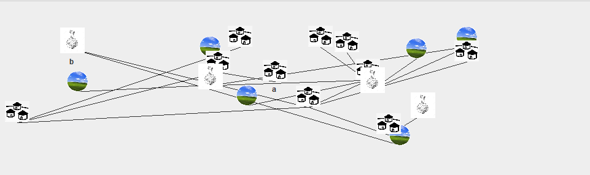
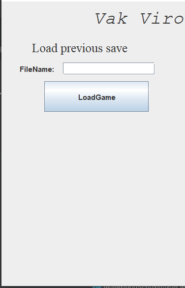
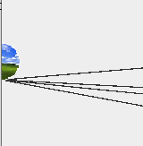

## Exploratory testing

## Tesztelési elv:
A felület általános megjelenésének vizsgálata/bírálata. A felületen szisztematikusan végighaladva a projekt futása közben tesztelni a különböző megjelenítési részeket.

### Fókusz teszt\részek tesztelése:
1. Equipment rész tesztelése:
    - nem volt semmi kiütköző probléma ezzel a résszel
2. Inventory rész tesztelése:
    - Ha több ugyanolyan típusú ágenst hozunk létre nem látszik a multiplicitás
    - nem írja ki a genetikai kódok és az ágensek neveit
3. Actions rész tesztelése:
    - nem azonos működés az action-ök megjelenítésénél
    - nem jelzi a játék ha egyes akciókat nem hajthatunk végre. 
4. Pálya rész tesztelése:
    - nem átlátható hogy melyik mező melyikhez csatlakozik
    - egyes mező ikonok egymásra csúsznak
    
    - a játékos neve ha túl hosszú, akkor nem látszik
    - ha két játékos áll egy mezőn az egyik nem látszik - néha felmerülő hiba
    - az összeköttetés vége nem a mező közepéig tart
    - ha megnyerjük a játékot, akkor csak kilép a játék 
    - nem tudjuk az AvaibleActions fül alapján hogy melyik mező a melyikhez tartozik a felületen
    - a mezők sokszor eltakarják a mezőn álló játékos nevét
5. Belépési menü rész  tesztelése:
    - a program nyelve nem egységes - félig angol félig magyar
    - a gombok túl nagyon az input mezőkhöz képest
    - a játék betöltése és az új játék lehetőség nincs egyértelműen elkülönítve
    - Players mezőbe bizonyos játékos megadása után nem látszik az újonnan megadott játékos neve.
    - az elvárt bemenet típusa nincs specifikálva - Seed esetén probléma lehet
    - átméretezéssel nem változik az elemek mérete
    - a LoadGame nem középre van igazítva

    

### Általános teszt/észrevételek: 
- a program nyelve nem egységes - félig angol félig magyar
- margók hiánya

- Nem írja ki a megadott játék nevét a felület
- a mezők megjelenítésénél nincsen margó ezért a szélén lévő ikonok egyes részei nem látsznanak
- a mezők alakja nem egységes, a képek pixelesek  
- az interakciók listájánál nincsn alsó margó
- AvailableAction egybe van írva
- a save funkciónál nem kapunk visszajelzést, hogy a mentés sikeres volt-e vagy sem.
- ha egy olyan akciót akarunk végrahajtani amit nem tudunk(Ágens létrehozása), akkor nem kapunk visszajelzést, hogy nem tudjuk végrehajtani
- nem kapunk visszajelzést az akcióinkról a felületen.

### Random teszt: 
A játékot végigjátszva random lépéseket végrehajtva teszteltük a UI működését. A fent leírt hibákon/észrevételeken kívül az elvárt működést tapasztaltuk. 

