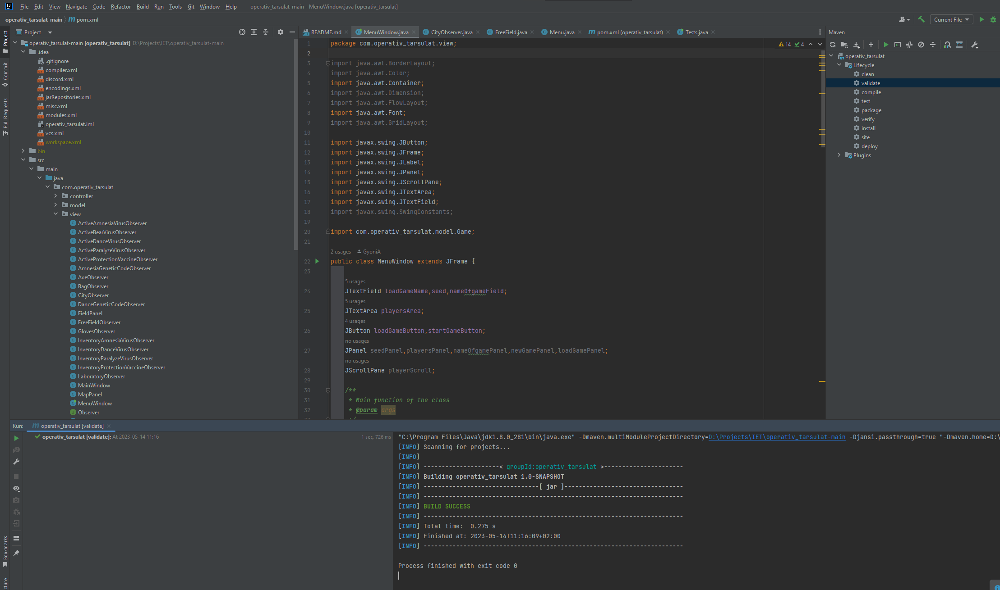
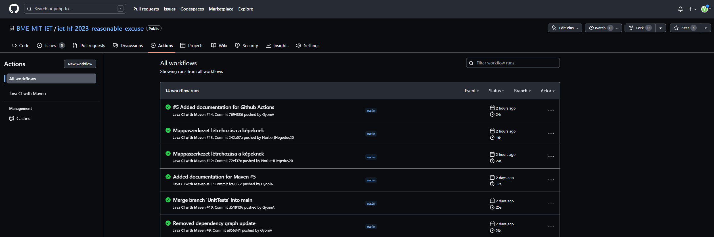

## Build keretrendszer beüzemelése
Ebben a projektben még nem volt használt keretrendszer.
A többi feladathoz használt eszközök közül több is a Maven alapú build rendszerre épül ezért ezt választottuk.
A Maven használatához szükséges volt a pom.xml fájl létrehozása, amelyben a projekt függőségeit és a build folyamatot lehet beállítani.

A képen látszik, hogy működik a Maven keretrendszer.

## CI beüzemelése
A CI beüzemeléséhez a GitHub Actions-t választottuk.
A GitHub Actions-t azért választottuk, mert a GitHub-on van a projektünk és a GitHub Actions ingyenesen használható nyílt forráskódú projektekhez.
A CI folyamatot a .github/workflows mappában lévő maven.yml fájlban definiáltuk.
A GitHub Actions előre definiált Maven folyamatából indultunk ki.
A hozzáadott tesztek így már minden main branchen történő push után lefutnak.

## Eredmények, tanulságok összefoglalása
A Maven használatával a projektünk függőségeit egyszerűen tudjuk kezelni, ez megkönnyítette/lehetővé tette a többi feladat elvégzését.

A Continuous Integration beüzemelése után a tesztek automatikusan lefutnak minden main branchen történő push után, ez megkönnyíti a fejlesztést és a hibakeresést, mert a hibás kódot hamarabb észrevehetjük és ezeket a teszteket nem kell manuálisan lefuttatni és konzisztens eredményeket kapunk.

